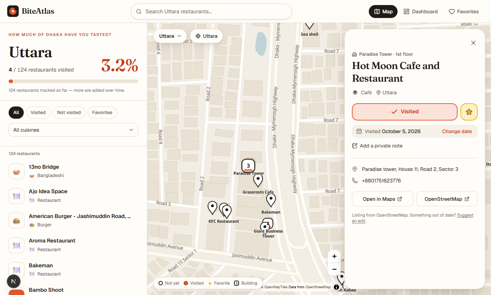
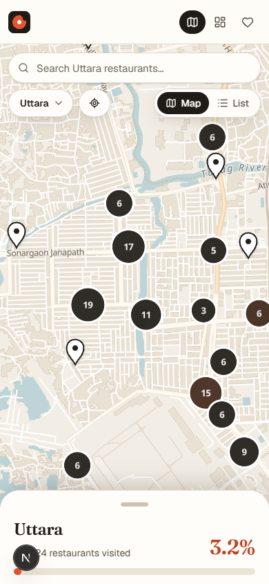
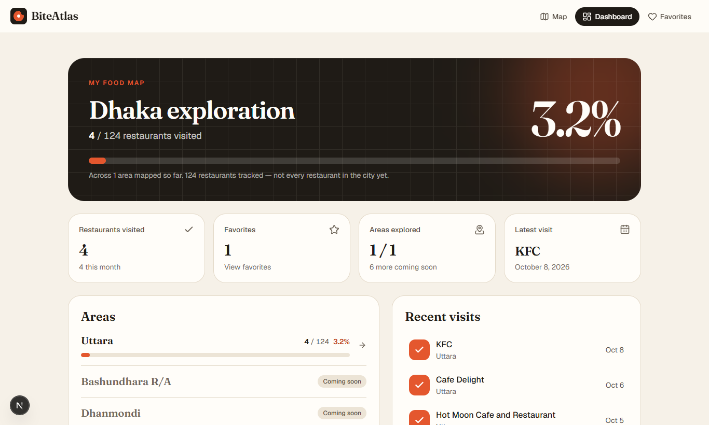
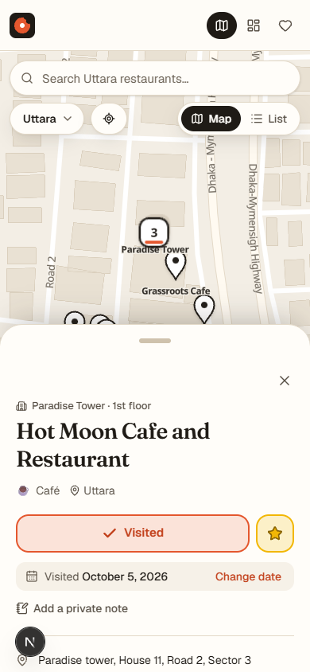

# BiteAtlas

**How much of Dhaka have you tasted?**
*Explore Dhaka. One restaurant at a time.*

BiteAtlas is a personal restaurant **exploration map**. Instead of helping you find somewhere to eat, it tracks where you've already eaten: mark restaurants as visited, and your map of Dhaka fills in. Think of it as Google Maps meets [Unseen Bangladesh](https://unseenbangladesh.com/) meets an achievement tracker.

V1 covers **Uttara**. The data model, UI and import tooling are built so Bashundhara, Dhanmondi, Banani, Gulshan, Mirpur and the rest can be added by adding data, without code changes.

| Desktop | Mobile |
| --- | --- |
|  |  |
|  |  |

---

## Features

- **A real map of Uttara.** MapLibre GL renders OpenStreetMap vector tiles with a custom warm, editorial palette. It opens framed on Uttara's restaurants, with the camera kept around Dhaka.
- **Custom markers.** Each state has its own canvas-drawn marker: not yet visited, visited, favorite, and visited + favorite. Markers are GPU symbol layers, not React DOM nodes.
- **Several restaurants in one building.** Restaurants have their own IDs and can belong to a building. A building is drawn as a stacked marker with a count (for example *Paradise Tower · 3*). Clicking it lists the restaurants inside with per-building progress.
- **Clustering and overlap handling.** Clusters show the number of restaurants and shift from ink to tomato as you visit more of them, with a gold ring when complete. Clicking a cluster zooms in. Markers that still overlap open a "Restaurants here" chooser.
- **Visited tracking.** Visiting a restaurant defaults the date to today, and you can change it. You can also favorite restaurants and add private notes. The marker, counters, percentage and progress bars update immediately, with optimistic saves and rollback on failure.
- **Progress per area and overall.** Precise values are kept internally and shown to one decimal (`19.8%`). Milestones ("First bite!", 10, 25, 50 …) get a small celebration.
- **Dashboard.** Shows overall Dhaka exploration, stats (visited, favorites, areas explored, latest visit, visits this month), per-area progress with "coming soon" areas, recent visits and cuisine progress.
- **Favorites page** with an empty state, grouped by area.
- **Search and filters.** Search is accent- and case-insensitive and also matches building names and Bangla names. You can filter by status (all, visited, not visited, favorites) and by cuisine. Picking a search result flies the map to that restaurant.
- **Accounts with Supabase Auth.** Email/password sign-in is supported, plus Google (behind a flag). **Guest mode** works without an account: progress is kept in the browser and merged into your account the first time you sign in.
- **Admin.** Server-verified admins can add, edit and deactivate restaurants, assign areas and buildings, set coordinates and set categories.
- **Responsive and accessible.** Desktop uses a sidebar plus a floating detail panel. Mobile uses a full-screen map with a draggable bottom sheet and a Map/List toggle. The restaurant list is a complete non-map alternative. Keyboard-operable combobox, visible focus, ARIA live regions, reduced-motion support and contrast-checked colors are built in.
- **Shareable deep links.** `?r=<restaurant-slug>` opens a specific restaurant.

## Data honesty

The Uttara dataset is **124 restaurants mapped in OpenStreetMap**, not every restaurant in Uttara. The UI says "124 restaurants tracked", never "all restaurants". Ratings are only shown when a source provides them. OSM doesn't, so none are invented. Uttara has no verified boundary in OSM, so **no boundary is drawn**. The map is framed on the area instead.

---

## Tech stack

| Concern | Choice |
| --- | --- |
| Framework | Next.js 16 (App Router, Cache Components, Turbopack), React 19, TypeScript |
| Styling | Tailwind CSS v4 with design tokens in `globals.css`; Radix primitives (dialog, popover) |
| Animation | Framer Motion (counters, progress, panel and sheet transitions) |
| Map | MapLibre GL JS 6 + [OpenFreeMap](https://openfreemap.org) vector tiles (OpenStreetMap data, no API key) |
| Data and auth | Supabase: Postgres + PostGIS, Auth, Row Level Security |
| Restaurant data | OpenStreetMap via the Overpass API (ODbL), plus JSON/CSV imports |
| Tests | `node:test` unit tests; database tests on PGlite + PostGIS (real Postgres, in-process) |

## Architecture

```
            ┌──────────── data/ (git-reviewed) ────────────┐
OSM ──fetch─▶ restaurants/uttara.osm.json   areas.json      │
CSV/JSON ───▶ restaurants/*.json|csv        categories.json │
            └───────────────┬──────────────────────────────┘
                            │ npm run db:import (service role, idempotent upserts)
                            ▼
   Supabase Postgres:  areas ─< buildings ─< restaurants >─ restaurant_categories >─ categories
                       auth.users ─< user_restaurants (RLS: owner only)   profiles (is_admin)
                            │
     getCatalog() — "use cache" + cacheTag("catalog"), public anon reads, prerendered
                            │                         (falls back to the bundled /data
                            ▼                          snapshot when Supabase isn't set)
   Root layout ─▶ CatalogProvider ─▶ VisitsProvider ─▶ pages (map, dashboard, favorites)
                                       │
                         guest: localStorage store   account: Supabase (RLS)
```

**Key decisions**

- **Catalog vs. personal data.** The restaurant catalog is public and identical for everyone, so it's fetched on the server, cached (`"use cache"`, tagged `catalog`) and prerendered into the static shell. Admin edits call `updateTag("catalog")`. Visits are private and loaded in the browser under the user's session, with RLS as the security boundary.
- **Places vs. restaurants.** The map draws *places*, each either a standalone restaurant or a building, while every restaurant keeps its own identity (`src/lib/restaurants/places.ts`). Coordinates are never used as identity.
- **Data-driven areas.** Nothing branches on "Uttara". Areas, including future ones, come from the `areas` table (`active` controls "coming soon"). Each area has a center, zoom and bbox. A `boundary_geojson` column exists for when a verified boundary is available.
- **Map provider abstraction.** Provider-specific code lives in `src/lib/map/`: style URL, theming of OpenMapTiles layers, the worker loader and marker artwork. Restaurant data never depends on the map provider.
- **Brand in one place.** `src/config/site.ts` holds the name, tagline and hero copy.
- **Snapshot mode.** Without Supabase env vars, the app runs on the bundled `/data` files with browser-only progress, so a fresh clone or preview deploy works immediately.

## Project structure

```
src/
  app/                    routes: / · /explore/[area] · /dashboard · /favorites · /login · /admin · /auth/callback
  proxy.ts                Supabase session refresh + optimistic /admin guard (Next 16 "proxy", formerly middleware)
  components/
    map/                  RestaurantMap (MapLibre), MapControls (area switcher, return-to-area, legend), MapFallback
    explore/              ExploreView, DetailPanel (desktop), MobileSheet (mobile), ProgressHero, SelectionContent
    restaurants/          RestaurantCard, RestaurantList, RestaurantPanel, VisitControls, PlaceGroupPanel, RestaurantSearch, FilterBar
    dashboard/            DashboardView, AreaProgress, StatsCard
    admin/                AdminView, RestaurantForm
    providers/            CatalogProvider, SessionProvider, VisitsProvider
    ui/ feedback/ layout/ auth/ brand/ favorites/
  config/site.ts          branding + feature flags
  lib/
    catalog/              import format, normaliser, repository (DB / snapshot)
    map/                  provider config, style theming, markers, worker loader
    restaurants/          places (building grouping), progress, filters/search, stats, formatting
    visits/               visit rules, guest store, Supabase persistence
    supabase/             browser / server / public clients
  types/                  domain + database types
data/                     areas.json, categories.json, restaurants/*.json|csv, raw/ (cached Overpass responses)
scripts/                  fetch-osm-restaurants.ts, import-restaurants.ts, copy-maplibre-worker.mjs
supabase/                 config.toml, migrations/, seed.sql
tests/                    logic.test.ts (unit), db-rls.mjs (migration + RLS on PGlite/PostGIS)
```

---

## Local setup

Requirements: **Node 20.9+** (22 LTS recommended). For the local database you also need **Docker Desktop**, which runs Supabase locally.

```bash
git clone https://github.com/souwmo04/Dhaka-Restaurant-Exploration-Map.git
```

```bash
cd Dhaka-Restaurant-Exploration-Map
```

```bash
npm install
```

### Option A: run without a database (snapshot mode)

```bash
npm run dev
```

Open http://localhost:3000. The map, search, filters, visit tracking (saved in your browser), dashboard and favorites all work. Accounts and admin need Supabase.

### Option B: full stack with local Supabase

1. Start Supabase (Postgres + PostGIS + Auth + Studio). The first run downloads Docker images.

   ```bash
   npm run db:start
   ```

   It prints an **API URL**, an **anon key** and a **service_role key**. The migration in `supabase/migrations` is applied automatically.

2. Create `.env.local` from the example and paste in those values:

   ```bash
   cp .env.example .env.local
   ```

   ```dotenv
   NEXT_PUBLIC_SUPABASE_URL=http://127.0.0.1:54321
   NEXT_PUBLIC_SUPABASE_ANON_KEY=<anon key>
   SUPABASE_SERVICE_ROLE_KEY=<service_role key>   # server-only; used by the import script
   NEXT_PUBLIC_SITE_URL=http://localhost:3000
   ```

3. Load the catalog (areas, categories, buildings, restaurants):

   ```bash
   npm run db:import
   ```

4. Run the app and create an account at `/login`. Local Supabase doesn't require email confirmation. Emails sent locally appear in the local mail viewer at http://127.0.0.1:54324.

   ```bash
   npm run dev
   ```

5. (Optional) Make yourself an admin. In Supabase Studio (http://127.0.0.1:54323) open the SQL editor and run:

   ```sql
   update public.profiles set is_admin = true
   where id = (select id from auth.users where email = 'you@example.com');
   ```

   Then open `/admin` from the account menu.

To reset the database (re-applies migrations; run `db:import` again afterwards):

```bash
npm run db:reset
```

### Using a hosted Supabase project instead

1. Create a project at [supabase.com](https://supabase.com). PostGIS is available as an extension and the migration enables it.
2. Apply the schema, either by pasting `supabase/migrations/*.sql` into the SQL editor or with the CLI:

   ```bash
   npx supabase link --project-ref <your-project-ref>
   ```

   ```bash
   npx supabase db push
   ```

3. Put the project URL, anon key and service role key in `.env.local`, then run `npm run db:import`.
4. In **Authentication → URL Configuration**, set the Site URL and add `https://<your-domain>/auth/callback` (and `http://localhost:3000/auth/callback`) to the redirect URLs.

### Google sign-in (optional)

1. Create an OAuth client in Google Cloud Console (type: Web application). Add `https://<project-ref>.supabase.co/auth/v1/callback` as an authorized redirect URI.
2. Supabase dashboard → **Authentication → Providers → Google**: enable it and paste the client ID and secret. For local Supabase, set `enabled = true` under `[auth.external.google]` in `supabase/config.toml` and put the credentials in `supabase/.env`.
3. Set `NEXT_PUBLIC_AUTH_GOOGLE_ENABLED=true` to show the button.

---

## Database schema

| Table | Purpose | RLS |
| --- | --- | --- |
| `areas` | Explorable areas: `slug`, `name`, center (`latitude`/`longitude`), `zoom`, `bbox`, optional verified `boundary_geojson`, `active`, `sort_order` | public read · admin write |
| `categories` | Cuisines (`slug`, `name`, `emoji`) | public read · admin write |
| `buildings` | Shared locations (`name`, `address`, coordinates, PostGIS `location`) | public read · admin write |
| `restaurants` | Own UUID primary key; `area_id`, optional `building_id`, `floor`, coordinates + generated PostGIS `location`, contact info, optional `rating`, `google_place_id` / `osm_id` (unique, **never** the PK), `source`, `active` | public read of active rows · admin write |
| `restaurant_categories` | Many-to-many; `is_primary` marks the main cuisine | public read · admin write |
| `profiles` | One per auth user (auto-created by trigger): `display_name`, `is_admin` | owner read/update; `is_admin` is not user-writable (column grants) |
| `user_restaurants` | One row per (user, restaurant): `visited`, `visited_at` (date), `favorite`, `notes`. Stores **no** copy of restaurant data. | owner-only select/insert/update/delete |

There is also `restaurants_near(lat, lng, radius_m)`, a PostGIS helper for future "nearby" or "nearest unvisited" features.

Verify the migration and every RLS rule against real Postgres + PostGIS (no Docker needed):

```bash
npm run test:db
```

## Restaurant data and imports

**Sources, in order of preference:** OpenStreetMap (Overpass API, ODbL), hand-curated JSON/CSV, other legally usable datasets, and optionally the official Google Places API. Google Maps pages are never scraped or automated.

### Refresh from OpenStreetMap

```bash
npm run data:fetch-osm -- uttara
```

This queries Overpass for restaurants, cafés, fast food, food courts, ice cream and bakeries inside the area's `bbox`. It drops places whose address puts them outside the area, and splits English and Bangla names. It also groups restaurants into **buildings** when they share an `addr:housename`, sit inside the same named OSM building, or share a house number + street within 40 m. The result is written to `data/restaurants/uttara.osm.json`, and the raw responses are cached in `data/raw/`. To re-process the cached responses offline:

```bash
npm run data:fetch-osm -- uttara --cached
```

### Import JSON or CSV

Every file in `data/restaurants/` is imported. Imports are **idempotent**: rows upsert on stable slugs.

```bash
npm run db:import
```

```bash
npm run db:import -- path/to/extra.csv --dry-run
```

JSON (a bare array, or `{ "restaurants": [...] }` with provenance metadata):

```json
[
  {
    "name": "Chillox Uttara",
    "area": "Uttara",
    "address": "Union Nahar Square",
    "latitude": 23.875,
    "longitude": 90.4,
    "categories": ["Burger", "Fast Food"],
    "building": "Union Nahar Square",
    "floor": "2"
  }
]
```

CSV columns: `name, area, latitude, longitude, categories (; separated), building, floor, address, phone, website, rating, google_place_id, osm_id, slug, name_bn, active`.

Restaurants sharing a `building` name within an area are grouped into one building. `area` and `categories` match by slug or name, case-insensitively.

> **Example only:** "Chillox / Union Nahar Square" above illustrates the format; it is not part of the dataset.

### Adding a new area (e.g. Dhanmondi)

1. Edit `data/areas.json`: give the area a `bbox` and set `"active": true`.
2. Fetch its restaurants:

   ```bash
   npm run data:fetch-osm -- dhanmondi
   ```

3. Import them:

   ```bash
   npm run db:import
   ```

4. For snapshot mode, register the new file in `src/lib/catalog/snapshot-data.ts`.

No component changes are needed. The area switcher, dashboard and overall progress all read from data.

### Google Places (optional, future)

The schema already has `google_place_id`, `rating`, `rating_count` and `photo_url`. A Places enrichment step should call the **official Places API (New) from server-side code only**, keep the key in a server env var (never `NEXT_PUBLIC_`), follow Google Maps Platform terms (attribution, caching limits, billing), and write through the importer. It isn't included because it needs credentials and billing, and the app doesn't depend on it.

## Map setup

No API key is needed. The default style is [OpenFreeMap Positron](https://openfreemap.org), re-themed at load time (`src/lib/map/style.ts`). To use another MapLibre-compatible style, set:

```dotenv
NEXT_PUBLIC_MAP_STYLE_URL=https://your-tiles.example.com/style.json
```

MapLibre's web worker is copied to `public/maplibre/` by a `postinstall` script, because bundlers can't follow MapLibre 6's runtime worker URL.

## Environment variables

| Variable | Where | Purpose |
| --- | --- | --- |
| `NEXT_PUBLIC_SUPABASE_URL` | browser + server | Supabase API URL. Omit to run in snapshot mode. |
| `NEXT_PUBLIC_SUPABASE_ANON_KEY` | browser + server | Public anon key; access is enforced by RLS. |
| `SUPABASE_SERVICE_ROLE_KEY` | **scripts only** | Used by `db:import`. Bypasses RLS: never expose it, and never set it in Vercel unless you run imports there. |
| `NEXT_PUBLIC_SITE_URL` | both | Canonical URL for metadata. |
| `NEXT_PUBLIC_AUTH_GOOGLE_ENABLED` | browser | `true` shows "Continue with Google". |
| `NEXT_PUBLIC_MAP_STYLE_URL` | browser | Optional custom map style. |

`.env*` files are git-ignored, except `.env.example`.

## Scripts

| Command | What it does |
| --- | --- |
| `npm run dev` / `build` / `start` | Next.js dev server / production build / serve the build |
| `npm run lint` · `typecheck` | ESLint · `tsc --noEmit` |
| `npm test` | Unit tests (progress, grouping, filters, visit rules, import) |
| `npm run test:db` | Migration + RLS tests on PGlite with PostGIS |
| `npm run check` | All of the above except the build |
| `npm run data:fetch-osm -- <area>` | Fetch an area's restaurants from OpenStreetMap |
| `npm run db:import` | Import `/data` into Supabase |
| `npm run db:start` · `db:stop` · `db:reset` · `db:types` | Local Supabase lifecycle and type generation |

## Deployment (Vercel)

1. Import the GitHub repo in Vercel. The framework preset is detected automatically.
2. Add `NEXT_PUBLIC_SUPABASE_URL`, `NEXT_PUBLIC_SUPABASE_ANON_KEY`, `NEXT_PUBLIC_SITE_URL` (your production URL) and, optionally, `NEXT_PUBLIC_AUTH_GOOGLE_ENABLED`.
3. In Supabase, add `https://<your-domain>/auth/callback` to the redirect URLs.
4. Deploy. The build prerenders every page and caches the catalog for an hour. Admin edits refresh it immediately.

Without Supabase variables the deploy still works, in snapshot mode. CI (`.github/workflows/ci.yml`) runs lint, typecheck, unit tests, database tests and a production build on every push.

## Roadmap

The architecture already supports these:

- **More areas.** This is a data task (see above).
- **Achievements** (First Bite, 10/50/100 restaurants, "Uttara Explorer"). Milestone toasts exist; persisting badges is a small table.
- **Cuisine progress.** This is already on the dashboard.
- **Visit timeline and yearly stats.** `visited_at` is a calendar date.
- **Share cards** ("Fahim's Dhaka Food Map: 43 visited, 19.8%"), **public profiles** and **friend comparison**. These need a `public_profile` flag and a view exposing only aggregate counts.
- **Nearest unvisited restaurant** with `restaurants_near()`.

## Credits and licenses

- Map data © [OpenStreetMap](https://www.openstreetmap.org/copyright) contributors. Tiles by [OpenFreeMap](https://openfreemap.org), schema © OpenMapTiles.
- Restaurant data in `data/restaurants/*.osm.json` is derived from OpenStreetMap and available under the [ODbL](https://opendatacommons.org/licenses/odbl/). If you redistribute it, keep the attribution and share-alike terms.
